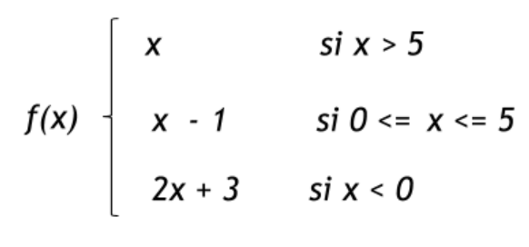

# Kata Introductoria

En esta primera kata los objetivos son

- verificar que tenés correctamente instalado el entorno
- familiarizarte con el uso del lenguaje Haskell y de la herramienta Visual Studio Code
- que entiendas el circuito básico de toda kata, bajando el enunciado desde un repositorio, completando el ejercicio y subiendo tu solución
- como BONUS: utilizar pruebas automatizadas para facilitar la validación del código que escribís

## Pre-requisitos

Necesitás instalar en tu notebook [el entorno Haskell](https://github.com/pdep-utn/enunciados-miercoles-noche/blob/master/pages/entorno-haskell.md)

## Ayuda

Si tenés dudas con Haskell podés ayudarte todo el tiempo con esta documentación

- [Guía de lenguajes](https://docs.google.com/document/d/1oJ-tyQJoBtJh0kFcsV9wSUpgpopjGtoyhJdPUdjFIJQ/edit?usp=sharing), un resumen de las principales funciones que vienen con Haskell
- [Hoogle](https://www.haskell.org/hoogle/), un motor de búsqueda específico para Haskell

Y para comenzar a trabajar con Git te recomendamos [este apunte inicial de Git](https://docs.google.com/document/d/1ozqfYCwt-37stynmgAd5wJlNOFKWYQeIZoeqXpAEs0I/edit). Una vez que estés familiarizado con el circuito, tenés un buen resumen de los comandos en las páginas 3 y 4 [de este apunte](https://docs.google.com/document/d/147cqUY86wWVoJ86Ce0NoX1R78CwoCOGZtF7RugUvzFg/edit#).

## El enunciado

Queremos modelar la siguiente función matemática, definida por partes:




Se pide definir _f_ en Haskell

## Pruebas

Podemos evaluar valores límite de la función f en la consola Haskell:

```hs
*Main> f 5
4
*Main> f 6
6
*Main> f 4
3
*Main> f 0
-1
*Main> f (-1)
1
```

También hacer pruebas por error:

```hs
*Main> f 'a'

<interactive>:7:3: error:
    * Couldn't match expected type `Integer' with actual type `Char'
    * In the first argument of `f', namely 'a'
      In the expression: f 'a'
      In an equation for `it': it = f 'a'
```

